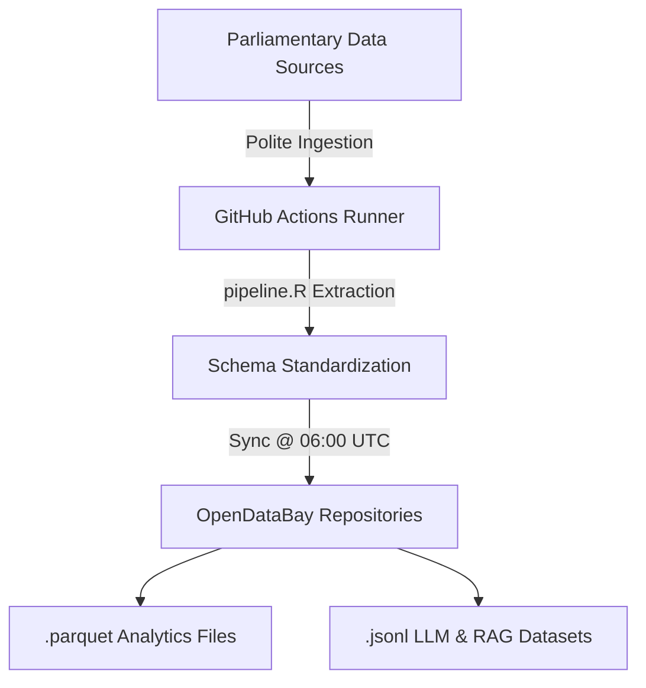

# AbyssDataLabs: OpenDataBay Parliamentary Data Engine 🏛️⚡

[](https://github.com/velvetcod3/AbyssDataLabs/actions/workflows/daily_scrape.yml)


**OpenDataBay** is an automated data pipeline designed to monitor, extract, and structure **UK Parliamentary** sector legislation and public sector intelligence.

Operating on a scheduled cloud architecture, the engine pulls raw parliamentary structures daily, parses metadata, enriches sector taxonomies, and publishes production-ready datasets directly to this repository.

---

## 🏗️ Architecture & Pipeline Overview



### Key Engineering Features
* **Automated Cloud Sync:** Runs on GitHub Actions scheduled at `06:00 UTC` daily.
* **Polite Ingestion:** Engineered with intentional request throttling to ensure respectful, low-impact API and web extraction.
* **Dual-Format Delivery:**
  * **`.parquet`**: High-performance columnar storage ideal for DuckDB, Pandas, and Tidyverse analytics.
  * **`.jsonl`**: Line-delimited JSON formatted specifically for LLM training pipelines, RAG context windows, and streaming.

---

## 📂 Sector Modules

Datasets are partitioned into dedicated sector modules:


| Sector Directory | Description | Formats |
| :--- | :--- | :--- |
| `tech_ai_cyber/` | UK technology policy, AI regulation, and cybersecurity initiatives | `.parquet` / `.jsonl` |
| `healthcare_nhs/` | UK public health legislation, NHS policy, and medical procurement | `.parquet` / `.jsonl` |
| `defense_procurement/` | UK Ministry of Defence spending, military strategy, and security bills | `.parquet` / `.jsonl` |
| `energy_climate/` | UK net-zero policy, green energy, and environmental regulation | `.parquet` / `.jsonl` |
| `finance_economy/` | UK economic reform, HM Treasury fiscal budgets, and trade frameworks | `.parquet` / `.jsonl` |
---

## 🚀 Quickstart Data Access

### Python (Pandas / DuckDB)

```python
import pandas as pd

url = "[https://raw.githubusercontent.com/velvetcod3/AbyssDataLabs/main/tech_ai_cyber/tech_ai_cyber.parquet](https://raw.githubusercontent.com/velvetcod3/AbyssDataLabs/main/tech_ai_cyber/tech_ai_cyber.parquet)"
df = pd.read_parquet(url)

print(f"Total Records: {len(df)}")
print(df.head())
```

### R (Tidyverse)

```
library(arrow)
library(dplyr)

url <- "[https://raw.githubusercontent.com/velvetcod3/AbyssDataLabs/main/tech_ai_cyber/tech_ai_cyber.parquet](https://raw.githubusercontent.com/velvetcod3/AbyssDataLabs/main/tech_ai_cyber/tech_ai_cyber.parquet)"
df <- read_parquet(url)

glimpse(df)
```
---

## ⚖️ License & Compliance

Distributed under the MIT License. Data sourced from parliamentary public records and made available for commercial, academic, and LLM applications.

**Compliance Notice:** All collected records consist strictly of public domain UK Parliamentary filings and contain zero Personally Identifiable Information (PII).